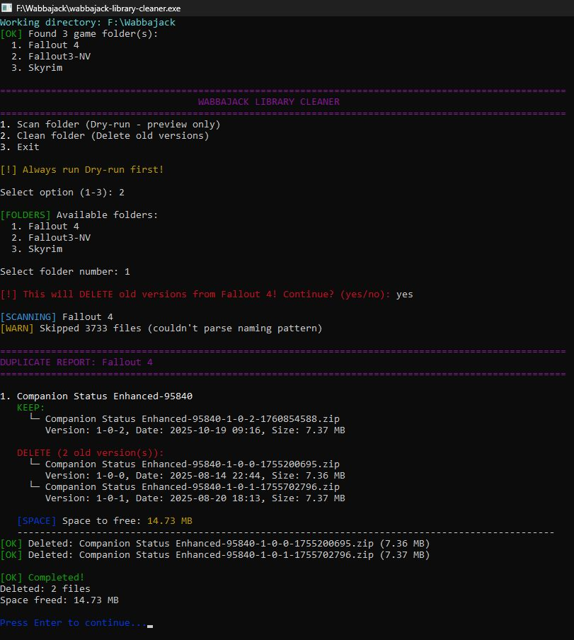

# Wabbajack Library Cleaner

A tool to clean up old mod versions from your Wabbajack downloads folder, freeing up disk space.

## 💡 The Problem

When a modlist updates, Wabbajack downloads new mod versions but keeps the old ones. Over time, you end up with multiple versions of the same mods eating disk space.

Many users keep their downloads folder because they don't have Nexus Premium - re-downloading everything would be slow and painful. But this leads to bloated folders with duplicate versions.

This tool scans your downloads folder, identifies duplicate mod versions, and removes the old ones while keeping the newest.

**⚠️ Important Note:** 
- Not all modlists use the newest mod versions. There's a small chance you might delete a version that's actually needed.
- Always run the dry-run preview (option 1) first to see what will be deleted.
- If a needed version gets deleted, you can re-download it from Nexus.
- Close MO2/Wabbajack before running this tool.

## 📸 Screenshots

### Preview Mode (Dry-Run)

*Shows what will be deleted before making any changes*

### Cleaning in Action

*Removing old versions and freeing up disk space*

## 🎯 Features

- **Smart Detection**: Groups mod versions by ModID and name
- **Safe**: Keeps the newest version of each mod
- **Preview First**: Dry-run mode shows what will be deleted before doing anything
- **Interactive**: Simple menu to choose which folders to scan
- **Logging**: All operations are logged
- **Multi-Game Support**: Works with all game folders (Skyrim, Fallout 4, etc.)

## 🛡️ Safety Features

- Keeps the newest version of each mod
- Skips files that are in use (file lock detection)
- Asks for confirmation before deleting anything
- Detailed logging with timestamps
- Skips temporary/incomplete files (`.part`, `.tmp`)

## � Usage

1. Download `wabbajack-library-cleaner.exe` from the [Releases](../../releases) page
2. Place it in your Wabbajack downloads directory (the folder that contains your game folders like Skyrim, Fallout4, etc.)
3. Run the executable
4. Select option `1` to preview what will be deleted
5. Select option `2` to actually delete old versions

### Menu Options

1. **Scan folder (Dry-run)** - Preview what will be deleted
2. **Clean folder** - Actually delete old versions
3. **Exit**

### Compile from Source (Optional)
```bash
# Prerequisites: Go 1.25 or later
go build -ldflags="-s -w" -o wabbajack-library-cleaner.exe
```

## ️ Mod File Naming Convention

The tool recognizes Wabbajack/Nexus Mods file naming:

```
ModName-ModID-Version-Timestamp.extension
```

Example:
```
Alternate Perspective-50307-4-0-3-1731841209.zip
├─ Mod Name: Alternate Perspective
├─ Mod ID: 50307
├─ Version: 4-0-3
└─ Timestamp: 1731841209 (Unix timestamp)
```

## 📝 Logging

All operations are logged to timestamped log files:
```
wabbajack-library-cleaner_YYYY-MM-DD_HH-MM-SS.log
```

Example log entries:
```
2025/10/28 10:56:59 [INFO] Scanning folder: F:\Wabbajack\Skyrim
2025/10/28 10:56:59 [INFO] Found 498 mod groups with duplicates
2025/10/28 10:56:59 [INFO] Skipped 9959 files (non-standard naming or meta files)
```


## 🔧 Technical Details

### Supported Archive Formats
- `.7z`
- `.zip`
- `.rar`
- `.tar`
- `.gz`
- `.exe`

### Performance
- Fast scanning
- Low memory usage
- Single executable, no dependencies

## 🐛 Troubleshooting

**"File is locked" error:** Close Mod Organizer 2 and Wabbajack before running

**Many files skipped:** This is normal - the tool automatically skips `.meta` files and files with non-standard naming patterns. When a mod archive is deleted, its `.meta` file is also automatically deleted.

**No duplicates found:** Your folder is already clean!

**Accidentally deleted a needed version:** You can re-download it from Nexus Mods

## 📜 License

MIT License - see [LICENSE](LICENSE) file for details

---

**Current Version:** v1.0.1

See [CHANGELOG](CHANGELOG.md) for version history.
